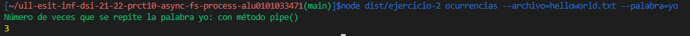
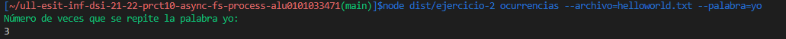
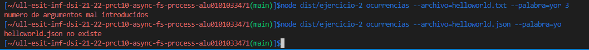
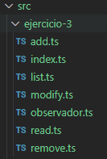
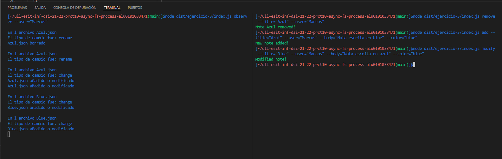
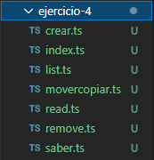
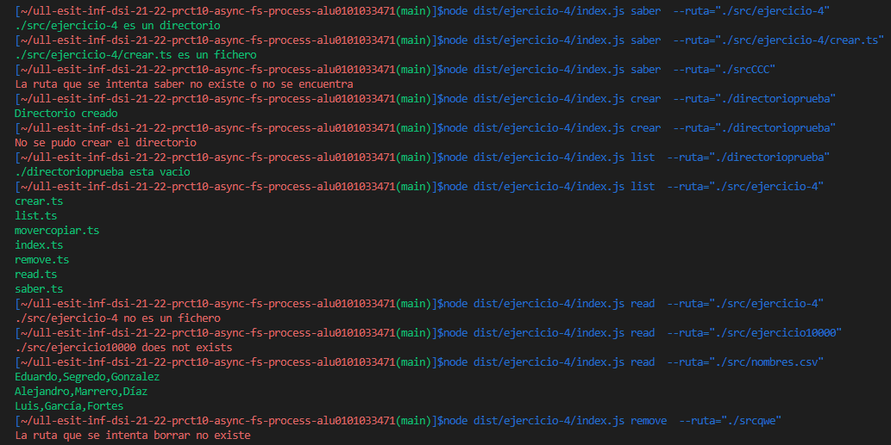
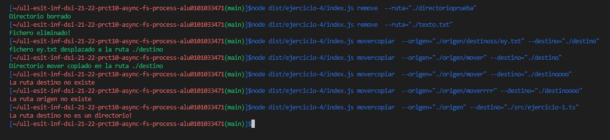

# Informe de la actividad
Práctica relacionada con el uso de  las APIs proporcionadas por Node.js para interactuar con el sistema de ficheros, así como para crear procesos.

## Ejercicio 1

Tras interactuar e intentar entender el siguiente código:
```typescript
import {access, constants, watch} from 'fs';

if (process.argv.length !== 3) {
  console.log('Please, specify a file');
} else {
  const filename = process.argv[2];

  access(filename, constants.F_OK, (err) => {
    if (err) {
      console.log(`File ${filename} does not exist`);
    } else {
      console.log(`Starting to watch file ${filename}`);

      const watcher = watch(process.argv[2]);

      watcher.on('change', () => {
        console.log(`File ${filename} has been modified somehow`);
      });

      console.log(`File ${filename} is no longer watched`);
    }
  });
}
```
Si se realiza una traza del programa, en caso de introducir por linea de comandos un número de argumentos distinto a 3, notifica de un error, en caso contrario la función access, si no encuentra el archivo pasado por argumento, notifica de un error y en caso de si encontrarlo comienza con un mensaje de inicio, se salta el proceso ** watcher.on ** y visualiza el último mensaje del programa. Después, por cada modificación en el fichero introducido por comando, se notificará con un mensaje por consola.

///¿Qué hace la función access? ¿Para qué sirve el objeto constants?

## Ejercicio 2

Como objetivo de este ejercicio se solicita un programa que devuelva el número de ocurrencias de una palabra en un fichero de texto de dos maneras:
1. Haciendo uso del método pipe de un Stream para poder redirigir la salida de un comando hacia otro.
2. Sin hacer uso del método pipe, solamente creando los subprocesos necesarios y registrando manejadores a aquellos eventos necesarios para implementar la funcionalidad solicitada.

Para este ejercicio se creo una clase **Ejercicio2** con un método para cada manera de llevar a acabo la solucion (**comando** y **comando2** ).
En un primer caso ambos métodos usan el paquete **yargs** para recivir el comando **ocurrencias** por parámetro, incluyendo el nombre de un archivo y una palabra para buscar. 
```Typescript
export class Ejercicio2 {
  constructor(){}

  comando(){
    yargs.command({
      command: 'ocurrencias',
      describe: 'Numero de veces que sale una palabra en el archivo',
      builder: {
        archivo: {
          describe: 'archivo',
          demandOption: true,
          type: 'string',
        },
        palabra: {
          describe: 'palabra',
          demandOption: true,
          type: 'string',
        }
    },
``` 
Posteriormente, en el manejador handler de ambos comandos, si el número de argumentos es igual a 5 y existe el archivo se desarrolla el método.
Para el primer caso, haciendo uso del método **spawn**, se crean constantes para un **cat** del archivo, un **grep** de la palabra y un **wc** con opcion **-l**.
Seguidamente, con el método **pipe**, unimos la propiedad de salidad **stdout** de la constante **cat** con la propiedad de entrada de la constante **grep** y posteriormente repetimos este paso pero con **grep** y **wc**. Finalmente el resultado que buscamos sera mostrado gracias al método **pipe** que unirá la propiedad de salidad **stdout** de la constante **wc** con el **process.stdout**. 
```Typescript
 handler(argv) {
      if(process.argv.length === 5){
        if (fs.existsSync(`${argv.archivo}`)){
          const cat = spawn('cat', [`${argv.archivo}`]);
          const grep = spawn('grep', [`${argv.palabra}`]);
          const wc = spawn('wc', [`-l`]);
  
          cat.stdout.pipe(grep.stdin);
          grep.stdout.pipe(wc.stdin);
          console.log(chalk.green(`Número de veces que se repite la palabra ${argv.palabra}:`));
          wc.stdout.pipe(process.stdout);
        }
```

Para el segundo caso, haciendo uso del método **spawn**, se crea la constante para un **cat** del archivo, la variable **catOutput** almacena el contenido de la salida estándar generada por el comando **cat**. 
Después, la propiedad **stdout** del objeto cat es un stream que emite un evento **data** con un objeto **buffer** y con el parametro **piece** apunta al buffer.
Seguidamnete, se añade un manejador que se ejecuta una vez el objeto **cat**** emite el evento close. Dicho manejador busca si coincide la palabra que se busca con las palabras del array y aumenta el **contador** para finalmente mostrar por consola el resultado.
```Typescript
  handler(argv) {
      if(process.argv.length === 5){
        if (fs.existsSync(`${argv.archivo}`)){
          const cat = spawn('cat', [`${argv.archivo}`]);
          let catOutput = '';
          let catOutputAsArray: string[] = [];
          cat.stdout.on('data', (piece) => catOutput += piece);
          
          let contador: number = 0;
          cat.on('close', () => {
            catOutputAsArray = catOutput.split(/\s+/);
            for(let i: number = 0; i < catOutputAsArray.length; i++){
              if (catOutputAsArray[i] === argv.palabra){
                contador++;
              }
            }
            console.log(chalk.green(`Número de veces que se repite la palabra ${argv.palabra}: con método pipe()`));
            console.log(contador);
         }); 
        }
```
En ambos comandos, si el archivo no existe o el numero de argumentos es incorrecto, se muestra por pantalla un mensaje de error en color rojo con el paquete **chalk**. 

## Resultado
### Método comando


### Método comando2


### Opciones de fallos



## Ejercicio 3
Como objetivo de este ejercicio, a partir de la aplicación de procesamiento de notas desarrollada en la Práctica 9, se pide desarrollar una aplicación que reciba desde la línea de comandos el nombre de un usuario de la aplicación de notas, así como la ruta donde se almacenan las notas de dicho usuario. La aplicación a desarrollar deberá controlar los cambios realizados sobre todo el directorio especificado al mismo tiempo que dicho usuario interactúa con la aplicación de procesamiento de notas.

### Explicación de modificación
En este caso, ya que la ruta del usuario contiene el nombre del usuario se ha hecho una pequeña modificacion y solo se necesita el nombre del usuario por linea de comandos.

### Desarrollo
Para este ejercicio se utilizó todos los archivos de la práctica 9 y se añadió un **observador.ts** que contiene la clase **Observer** con el método **ObserverNote()**, el cual, mediante el paquete **yargs**, con el comando **observer** y el nombre de usuario, hace uso de la función **watch**, mostrando por consola el nombre del archivo y el tipo de evento. Esta función puede visualizar el resultado más de una vez.
```Typescript
  export class Observer {
  constructor(){}

  ObserverNote(){
    yargs.command({
      command: 'observer',
      describe: 'Observa el directorio del usuario',
      builder: {
        user: {
          describe: 'Name user',
          demandOption: true,
          type: 'string',
        }
      },
      handler(argv) {
         if (!fs.existsSync(`./dist/ejercicio-3/${String(argv.user)}`)){
          console.error(chalk.red('El usuario no tiene un directorio creado'));
        } else {
          fs.watch(`./dist/ejercicio-3/${String(argv.user)}`, (eventType, filename) =>{
            console.log("\nEn l archivo", filename);
            console.log("El tipo de cambio fue:", eventType);
            fs.access(`./dist/ejercicio-3/${String(argv.user)}/${filename}`, fs.constants.F_OK, (err) => {
              console.log(`${filename} ${err ? 'borrado' : 'añadido o modificado'}`);
            });
          });
        }
      },
    });
  }
}
```

## Estructura


## Resultado


Aclarar, que el evento que emite el objeto Watcher cuando se crea un nuevo fichero en el directorio observado es del tipo rename y change, cuando se modifica es del tipo change y cuando se elimina es del tipo rename. 

Respondiendo a las cuestiones que se hacen en el ejercicio,
Para mostrar, no solo el nombre, sino también el contenido del fichero, en el caso de que haya sido creado o modificado se haría uso de la función **readFile** pasando como nombre del archivo la variable **filename**.
Y para que no solo se observase el directorio de un único usuario sino todos los directorios correspondientes a los diferentes usuarios de la aplicación de notas, en la función **watch** se debe realizar sobre el directorio que almacena los directrorios de los usuarios y activar la opción **recursive** que permite observar todos los subdirectorios que por defecto esta a **false**.

## Ejercicio 4

Como objetivo de este ejercicio, se pide una aplicación que permita hacer de wrapper de los distintos comandos empleados en Linux para el manejo de ficheros y directorios.

Para este ejercicio se ha creado un **index.ts** que crea los objetos para cada operación, llama al método correspondiente y   ejecuta el **yargs.parse()**. Además se ha creado una clase para cada operación.
### Desarrollo
#### 1. Dada una ruta concreta, mostrar si es un directorio o un fichero.
Para resolver este apartado, se crea una clase **Saber** con un método **saberRuta**, el cual, haciendo uso del paquete **yargs**, se ejecuta con el comando **saber** y se construye con un parametro **ruta**. En el manejador **handler** se ejecuta el método **stat**, para posteriormente poder hacer uso de la función **isDirectory()** con el cual se puede saber si la ruta corresponde con un directorio. En caso negativo la ruta sería un fichero. ya que si la ruta no corresponde ni con un fichero ni con un dfirectorio se notifica con un error previamente.

```Typescript
export class Saber {
  constructor(){}
  saberRuta(){
    yargs.command({
      command: 'saber',
      describe: 'Saber si la ruta es un directorio o un fichero',
      builder: {
        ruta: {
          describe: 'ruta a saber',
          demandOption: true,
          type: 'string',
        }
      },
      handler(argv) {
        fs.stat(`${argv.ruta}`, (err, stats) => {
          if (err){
            console.error(chalk.red(`La ruta que se intenta saber no existe o no se encuentra`));
          } else {
          if (stats.isDirectory()) {
            console.log(chalk.green(`${argv.ruta} es un directorio `));
          } else {
            console.log(chalk.green(`${argv.ruta} es un fichero`));
          }
        }
        });
      },
    });
  }
}  
```
#### 2.Crear un nuevo directorio a partir de una nueva ruta que recibe como parámetro.
Para resolver este apartado, se crea una clase **Crear** con un método **crearDirectorio**, el cual, haciendo uso del paquete **yargs**, se ejecuta con el comando **crear** y se construye con un parametro **ruta**. En el manejador **handler** se ejecuta el método **mkdir** con el parámetro **ruta**, si no es posible la creación de dicho directorio se notifica de un mensaje de error y en caso de que se pueda crear, se notifica con un mensaje de directorio creado.
```Typescript
export class Crear {
  constructor(){}
  crearDirectorio(){
    yargs.command({
      command: 'crear',
      describe: 'crea un directorio a traves de la ruta que recibe',
      builder: {
        ruta: {
          describe: 'ruta del directorio',
          demandOption: true,
          type: 'string',
        }
      },
     
      handler(argv) {
       
        fs.mkdir(`${argv.ruta}`, (err) => {
          if (err) {
            return console.error(chalk.red(`No se pudo crear el directorio`));
          }
          else {
            console.log(chalk.green(`Directorio creado`));
          }
        });
        
      },
    });
  }
}
```
#### 3.Listar los ficheros dentro de un directorio.
Para resolver este apartado, se crea una clase **List** con un método **listar**, el cual, haciendo uso del paquete **yargs**, se ejecuta con el comando **list** y se construye con un parametro **ruta**. En el manejador **handler** se ejecuta el método **readdir** sobre el parámetro **ruta**, si no es posible la lectura de dicho directorio se notifica de un mensaje de error y en caso de que se pueda leer, se realiza un bucle **forEach** sobre el evento **files** para poder obtener en la variable **file** el contenido por separado del directorio. Dentro del bucle se hace uso del método **stat** y de la misma forma que en la clase **Saber** si el contenido de la variable **file** no es un directorio (corresponde entonces con un fichero) se muestra su nombre por consola. Además, para el caso de que el directorio no contenga ningún archivo, se hace uso de un contador **i** para notificar de la falta de archivos en el caso de que su valor sea 0.
```Typescript
export class List {
  constructor(){}
  listar(){
    yargs.command({
      command: 'list',
      describe: 'Listar un directorio',
      builder: {
        ruta: {
          describe: 'Ruta a listar',
          demandOption: true,
          type: 'string',
        }
      },
      handler(argv) {
        fs.readdir(`${argv.ruta}`, (err, files) =>  {
          if(err){
            console.error(chalk.red(`${argv.ruta} no existe`));
          } else {
            let i:number = 0;
            files.forEach(file => {
              fs.stat(`${argv.ruta}/${file}`, (err, stats) => {
                if (err){
                  console.error(chalk.red(`La ruta que se intenta saber no existe o no se encuentra`));
                } else {
                if (!stats.isDirectory()) {
                  console.log(chalk.green(`${file} `));
                } 
              }
              });
              i++;
            });
            if(i === 0){
              console.log(chalk.green(`${argv.ruta} esta vacio`));
            }
          }
        });
      },
    });
  }
}
```
#### 4.Mostrar el contenido de un fichero.
Para resolver este apartado, se crea una clase **Read** con un método **read**, el cual, haciendo uso del paquete **yargs**, se ejecuta con el comando **read** y se construye con un parametro **ruta**. En el manejador **handler** se pregunta primero si no existe la ruta que se ha pasado, en caso de no existir se notifica de un error y en caso afirmativo se usa el método **readfile** y se pasa por consola el evento **data** pasado a string.
```Typescript
export class Read {
  constructor(){}
  read(){
    yargs.command({
      command: 'read',
      describe: 'Leer el contenido de un fichero',
      builder: {
        ruta: {
          describe: 'Ruta',
          demandOption: true,
          type: 'string',
        }
      },
      handler(argv) {
        if (!fs.existsSync(`${argv.ruta}`)){
          console.error(chalk.red(`${argv.ruta} does not exists`));
        } else {
          fs.readFile(`${argv.ruta}`, (err, data) => {
            if(err){
              console.error(chalk.red(`${argv.ruta} no es un fichero`));
            } else {
            console.log(chalk.green(data.toString()));
            }
          });
        }
      },
    });
  }
}
```
#### 5.Borrar ficheros y directorios.
Para resolver este apartado, se crea una clase **Remove** con un método **remove**, el cual, haciendo uso del paquete **yargs**, se ejecuta con el comando **remove** y se construye con un parametro **ruta**. En el manejador **handler** se ejecuta el método **stat** y como en otros casos, si es un directorio se realiza el método **rm** de forma recursiva para poder eliminar todo el contenido. Y en caso de ser un fichero la eliminación de dicho fichero se realiza con el método **unlinkSync**.
```Typescript
export class Remove {
  constructor(){}
  remove(){
    yargs.command({
      command: 'remove',
      describe: 'Elimina la ruta',
      builder: {
        ruta: {
          describe: 'Ruta a borrar',
          demandOption: true,
          type: 'string',
        }
      },
      handler(argv) {
        fs.stat(`${argv.ruta}`, (err, stats) => {
          if (err){
            console.error(chalk.red(`La ruta que se intenta borrar no existe`));
          } else {
          if (stats.isDirectory()) {
            fs.rm(`${argv.ruta}`,  { recursive: true }, (err) => {
              if (err) {
                return console.error(chalk.red(`No se pudo borrar el directorio`));
              }
              else {
                console.log(chalk.green(`Directorio borrado`));
              }
            });
          } else {
              fs.unlinkSync(`${argv.ruta}`);
              console.log(chalk.green(`Fichero eliminado!`));
          }
        }
        });
      },
    });
  }
}
```
#### 6.Mover y copiar ficheros y/o directorios de una ruta a otra. 
En este caso, se ha implementado copia para los directorios y mover para los ficheros.
Para resolver este apartado, se crea una clase **MoveryCopiar** con un método **moverCopiarRuta**, el cual, haciendo uso del paquete **yargs**, se ejecuta con el comando **movercopiar** y se construye con un parametro **origen** para la ruta de origen y un parametro **destino** para la ruta de destino. 
```Typescript
export class MoveryCopiar {
  constructor(){}
  moverCopiarRuta(){
    yargs.command({
      command: 'movercopiar',
      describe: 'Mueve un fichero o copia un directorio',
      builder: {
        origen: {
          describe: 'ruta origen',
          demandOption: true,
          type: 'string',
        },
        destino: {
          describe: 'ruta destino',
          demandOption: true,
          type: 'string',
        }
      },
```

En el manejador **handler** se ejecuta el método **stat** y como en otros casos, si el **origen** un directorio se realiza otro método **stat** para saber si la ruta **destino** también es un directorio, en caso afirmativo, gracias al método **split**, guardamos el nombre del directorio en la variable **nombre** y se usa el método **cp** para copiar el directorio del origen en la ruta destino. 
```Typescript
handler(argv) {
  fs.stat(`${argv.origen}`, (err, stats) => {
    if (err){
      console.error(chalk.red(`La ruta origen no existe`));
    } else {
      if (stats.isDirectory()) {
        fs.stat(`${argv.destino}`, (err, statss) => {
          if (err){
            console.error(chalk.red(`La ruta destino no existe`));
          } else {
            if (statss.isDirectory()) {
              let directorio: string[] = String(argv.origen).split(`/`);
              let nombre: string = directorio[directorio.length - 1];
              fs.cp(`${argv.origen}`, `${argv.destino}/${nombre}`,{ recursive: true },(err) => {
                if(err){
                  console.error(chalk.red(`No se pudo copiar`));
                } else {
                  console.log(chalk.green(`Directorio ${nombre} copiado en la ruta ${argv.destino}`));
                }
              });
            } else {
              console.error(chalk.red(`La ruta destino no es un directorio!`));
            }
          }
        });
```
En el caso de que la ruta **origen** sea un fichero, se comprueba tambien que la ruta **destino** sea un directorio, y en caso afirmativo se almacena el nombre del fichero en la variable **nombre** y se usa el método **renameSync** para mover el fichero a la ruta **destino**.
```Typescript
 } else {
    fs.stat(`${argv.destino}`, (err, statss) => {
      if (err){
        console.error(chalk.red(`La ruta destino no existe`));
      } else {
        if (statss.isDirectory()) {
          let fichero: string[] = String(argv.origen).split(`/`);
          let nombre: string = fichero[fichero.length - 1];
          fs.renameSync(`${argv.origen}`,`${argv.destino}/${nombre}`);
          console.log(chalk.green(`fichero ${nombre} desplazado a la ruta ${argv.destino}`));
        } else {
            console.error(chalk.red(`La ruta destino no es un directorio!`));
        }
      }
    });  
  }
```

## Estructura


## Resultado



 
Para la comprobación de estos resultados se han creado ficheros y directorios de prueba.
